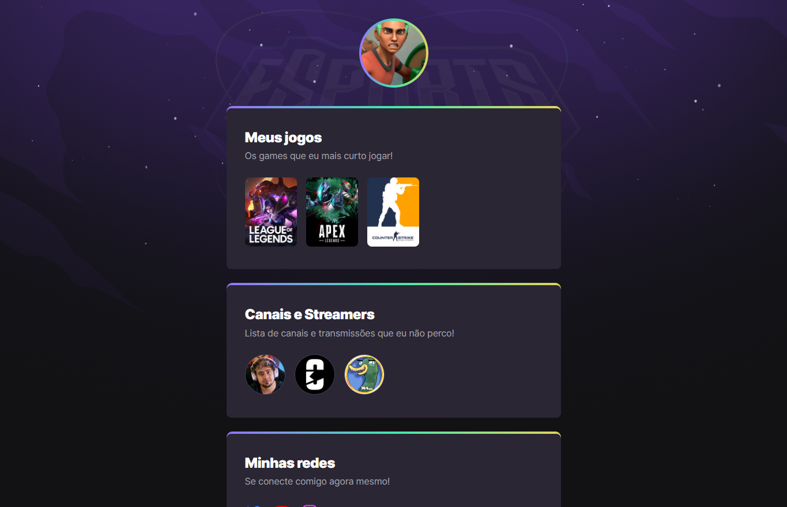

# NLW eSports 

> Trilha Explorer

Projeto construído no evento Next Level Week da Rocketseat

[Clique aqui para acessar](https://lukeddev.github.io/NLW-ESPORTS/)

## Tecnologias

- HTML
- CSS
- Git e Github

## O que aprendi

Esse foi meu primeiro site criado do zero, foi uma experiência incrivel e bastante divertida. 

Tive meu primeiro contato com o front end, que foi a área que eu mais gostei durante meus estudos.

Minha mente já está borbulhando possíbilidades de modificação e reconstrução da temática desse site.

## Contato@

lucasd.dev@gmail.com